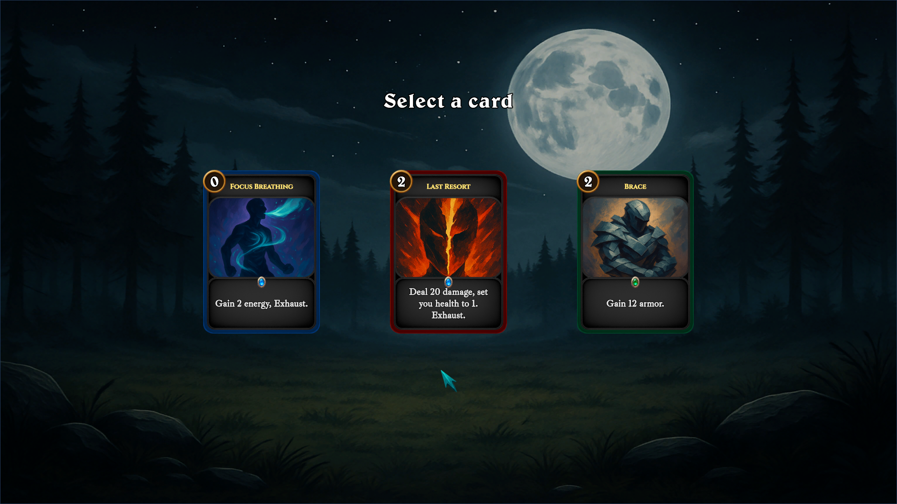
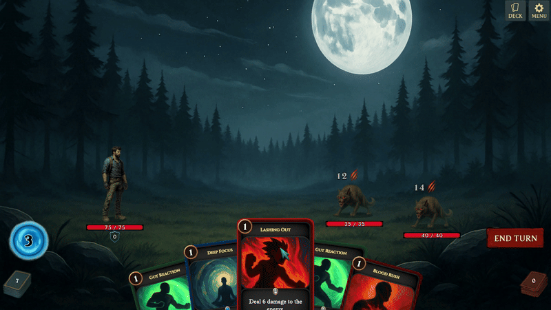
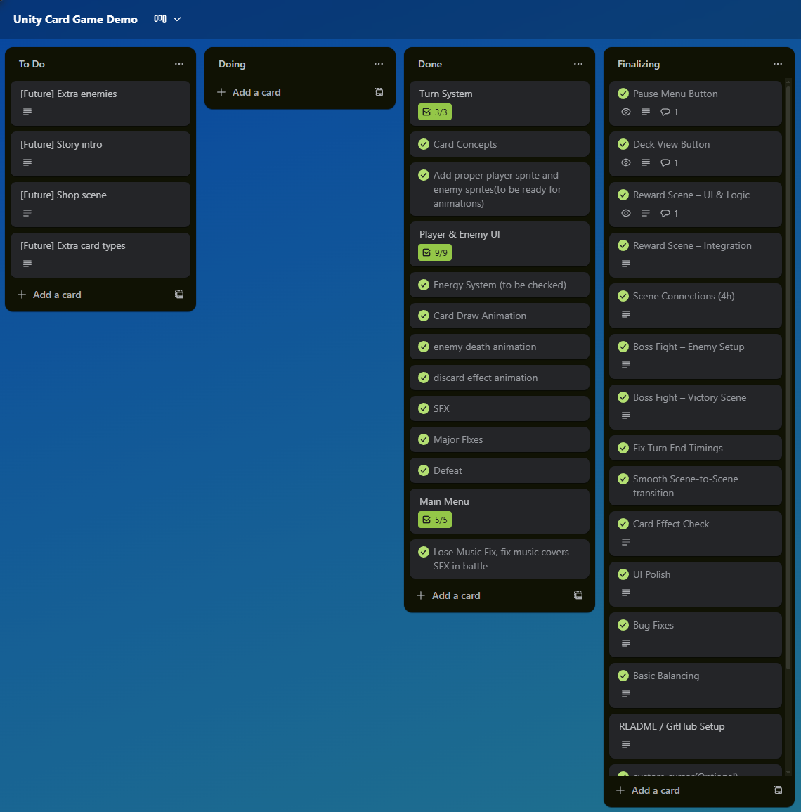

# Turn-Based Deckbuilder Prototype (Unity)

A prototype built in **Unity (C#)** to practice roguelike deck-builder mechanics.  
This project was developed purely as a **learning exercise** and is not intended as a commercial release.

---

## 🎮 Overview
This prototype replicates core elements of *Slay the Spire* to help me learn:
- Unity architecture & scripting in C#
- Turn-based combat systems
- Card mechanics and UI interactions
- Modular design principles with managers & interfaces

---

## 📸 Screenshots

### Combat

### Reward Screen

### Gameplay GIF

---

## ✨ Features
- **Turn-based card combat** system  
- **Player stats** (HP, armor, energy)  
- **Buffs / debuffs** implementation  
- **Enemy AI with intent system** (telegraphed actions)  
- **Reward & card selection** flow  
- **Card polish**: hover effects, drag & drop, smooth animations  

---

## 🧩 Learning Focus
- Practiced Unity **modular architecture** (Managers, interfaces, ScriptableObjects)  
- Implemented **AI behaviors** with intent previews  
- Explored **UI polish & UX feedback** for cards  
- Used **GitHub** for version control & project organization  

---

## ▶️ How to Play
- **Play in browser**: https://fouzis.itch.io/card-battler-unity-learning-clone-inspired-by-slay-the-spire
- **Download build**: https://github.com/DimitrisFuzi/UnityRoguelikeCardGame/releases/download/v0.1.0-learning-clone/CardBattler_LearningClone_v0.1.0_Windows.zip 

**Controls**  
- Hover a card to highlight it  
- Left-click & drag to play a card  
- Click the **End Turn** button to finish your turn  

---

## 🛠️ Tech Stack
- Unity 6 (Editor version: 6000.2.0b7 at time of development) 
- C#  
- GitHub Desktop
- GIMP  2.1
- Audacity
- Trello

---

## ⚠️ Disclaimer
This project is a **learning clone inspired by Slay the Spire**.  
All assets are placeholders or sourced for educational purposes only.

---

### 🗂 Project Management & Workflow
This project was organized and tracked using **Trello** with a simple Kanban workflow (To Do → Doing → Done → Finalizing).  
The board helped structure development into smaller milestones and ensured progress tracking for features, bug fixes, and polish.  

## 🚀 Next Steps
- Apply learnings to an **original roguelike card game project**  
- Expand with new enemy types & events  
- Continue improving UI & UX polish  

---

## 👤 Credits
- Developed by **Foutzitzakis Dimitris**  
- Code, gameplay systems & UI: self-developed for learning purposes  
- Music & SFX: royalty-free assets (opengameart.org, pixabay.com, soundimage.org)  

---
